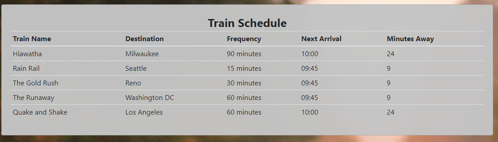
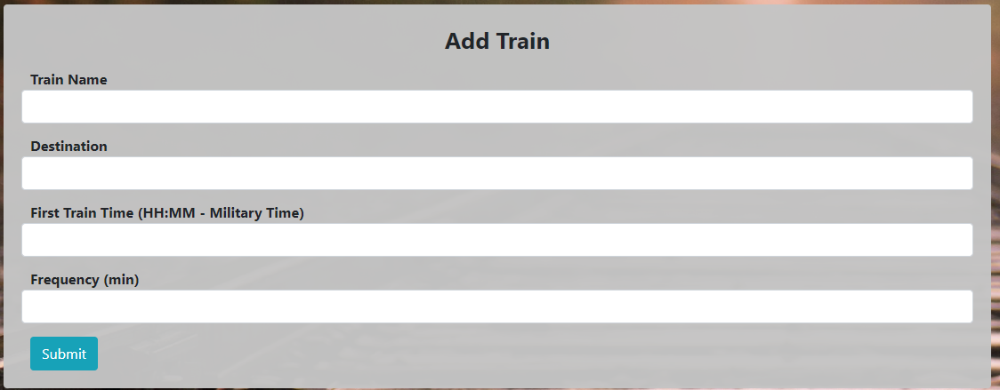

# Train-Schedule

Title: Train Schedule
Developer: Kevin Flerlage  
Deployment Date: 10/18/2018  
For: Northwestern Coding Bootcamp 

A made up train schedule that will tell you when the next departure is and gives you the time from now.

## Schedule Demo

The Schedule pulls data from firebase, loads them into a table. When the data is loaded into the window it then uses the Moment.js to manipulate time and tell when the next train will arrive.

## Add Trains

This form allows you to add your own custom train. When you press the submit button it will submit all the data from the input fields into firebase. The firebase then updates the table.

## Updates

This homework assignment has much room for improvement through style as well user validation. If you put letters or the incorrect formatting into the input fields and press submit you will break the app.

Rather than update this and make this homework more complete, I am going to focus on Project #1.